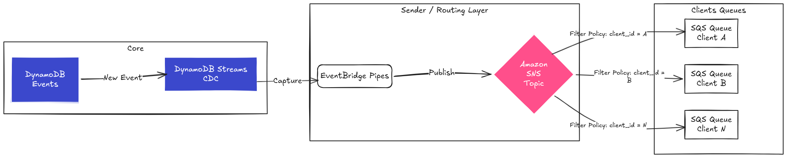
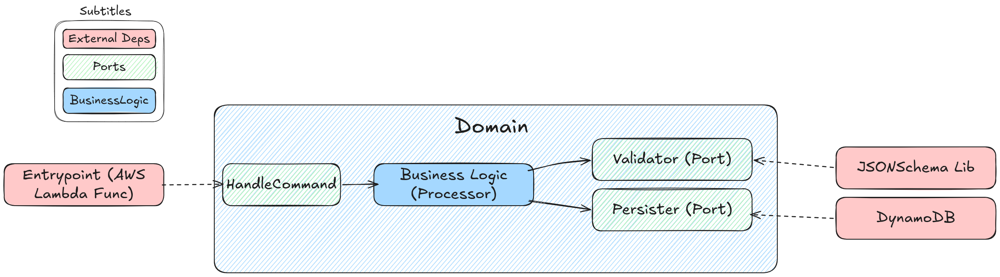

# Event Processor

**[Português](readme.md)** | **English**

---

This project implements an **Event Processor** component for a data platform. The goal is to build a reactive service focused on consuming events from a message queue, validating them against predefined contracts, and performing triage. The final result must ensure low latency for consumption by subsequent services, operating resiliently in a multi-tenant ecosystem.


---

## 📑 Table of Contents

1. [🏗️ Architecture and Technical Decisions](#️-1-architecture-and-technical-decisions)
   - [Solution Diagram](#solution-diagram)
   - [Justification for Some Choices](#justification-for-some-choices)
2. [💻 Code Design (Hexagonal Architecture)](#-2-code-design-hexagonal-architecture)
3. [📋 Implementation Roadmap](#-3-implementation-roadmap)
   - [Functional Requirements](#functional-requirements)
   - [Non-Functional Requirements](#non-functional-requirements)
4. [🚀 How to Run](#-4-how-to-run)
   - [Step by Step](#step-by-step)
   - [Evolution Points](#evolution-points)
5. [🧪 Testing and Quality](#-5-testing-and-quality)

---

## 🏗️ 1. Architecture and Technical Decisions

To meet scalability and resilience requirements, the following stack was defined for local simulation:

### Solution Diagram


### Justification for Some Choices

* **Messaging (AWS SQS):** Chosen to ensure that no events are lost in case of failures. SQS will act as the event queue and will be configured with a Dead Letter Queue (DLQ) for messages that are invalid or have processing issues.
  * I had considered using Kafka, but opted for SQS for the following reasons:
    * Native integration (*Event Source Mapping*) with AWS Lambda.
    * Since the proposed architecture does not require strict processing order guarantees or historical event *replay*, SQS perfectly meets the messaging requirement with resilience without the overhead of managing *brokers*, partitions, or *offsets* required by Kafka.
* **Processing (AWS Lambda in Go):** The architecture will use the *Event-Driven* model with AWS Lambda (Go programming language) natively triggered by SQS.
  * *Why not Kubernetes with HPA?* Although running the application in pods within a Kubernetes cluster and horizontally scaling them (HPA) by observing queue depth is a robust approach, it introduces significant operational complexity (cluster management, manifests, etc.). AWS Lambda offers elastic scalability managed by the cloud itself, instantiating new execution environments immediately as queue volume increases. This perfectly meets the requirement to create a high-performance reactive service, prioritizing **simplicity**, even if this architecture is not the cheapest initially.
* **Validation (JSON Schema):** To meet the declarative contract rule, JSON *schemas* will be cached in memory during Lambda initialization, validating the *payload* extremely quickly. (Schemas will be loaded through a DynamoDB table containing the `event_type` and the `schema` itself).
    - Other validation methods would be, for example, using Protobuf (Protocol Buffers), structural validation in code via *struct tags*, but I chose JSON Schema because it allows specifying events declaratively and can be used as the basis for validation. In addition to being **language-agnostic and natively supported by JSON payloads (industry standard)**, it allows adding new producers and rules by simply including new records in the contract table (`schemas`), without the need to recompile the application.
* **Persistence (AWS DynamoDB):** NoSQL database that scales horizontally by nature. The modeling will use the `Partition Key` to group data by `client_id` (multi-tenant) and `Sort Key` with a unique event id to ensure message idempotency (ideally we work with some sequential uuid here, such as `uuidv7` which I used in the `producer`). The use of *DynamoDB Streams* will act as a CDC (Change Data Capture), enabling low-latency consumption by other services (Sender).
  * I had initially considered PostgreSQL or CassandraDB, however:
  * *Why not PostgreSQL?* Although Postgres can handle dynamic payloads using the `jsonb` type, relational databases face horizontal scalability bottlenecks in high ingestion (*write-heavy*) scenarios and would require complex connection pool management via Lambda.
  * *Why not CassandraDB?* Cassandra would handle high write volumes and scalability perfectly, but would add considerable operational complexity (cluster maintenance and tuning) that goes against the simplicity premise. DynamoDB delivers the same performance in the *Serverless* model.
  * TO-DO: Mention/study the importance of TTL for messages. Depending on the number of events, keeping all of them persisted will take up a lot of disk space. Perhaps, since we will already make events available with DynamoDB Streams, it's worth putting a TTL on messages and, maybe, moving them to S3 for permanence.
* **Observability (Logs, Metrics, and Traces):**
  * *Logs:* I adopted the **Structured Logging** pattern. Instead of multiple sequential I/O logs, the application consolidates the execution context and emits a single JSON payload per processed event (containing `event_id`, `client_id`, execution time and status, etc.). I made this decision after reading this blog and agreeing with its vision: [Logging Sucks](https://loggingsucks.com/). The native destination is **Amazon CloudWatch**, since we log to stdout of AWS Lambdas.
  * *Metrics:* Lambda itself gives us metrics/alerts for invocations, errors, and duration. SQS also gives us `Queue Depth`.
  * *Tracing:* Since our processing flow is already `SQS -> Lambda -> DynamoDB`, I would use **AWS X-Ray** for distributed tracing and complete service map visualization to debug performance bottlenecks. This was more difficult to simulate locally because localstack requires the `pro` plan to visualize it.
  
  It's not ideal, we could use OTEL for metrics and tracing, for example, but given the project delivery time, I opted for simplicity.
* **Routing (Sender):** For the subsequent service (`Sender`), it was not in scope to implement it here, but I think it's worth commenting on a strategy for delivering these events in a multi-tenant scenario. Since the `Sender` needs to deliver messages to multiple end clients in isolation, the strategy I would adopt would be **Fan-out with Amazon SNS + Message Filtering**. We would use `EventBridge` to capture DynamoDB Streams and publish all events to a single SNS topic. Each client would have an exclusive SQS queue subscribed to this topic, containing a *Filter Policy* pointing to their respective `client_id`.

  
---
## 💻 2. Code Design (Hexagonal Architecture)



To ensure software quality and protect business logic, I used **Hexagonal Architecture (Ports and Adapters)** concepts. This decision aims to ensure low coupling, prioritizing maintainability and ease of creating tests.

The application structure was divided as follows:

* **Input Ports (Driving Adapters):** Represented by the application *entrypoint* (the AWS Lambda *handler* consuming SQS). I chose not to create overly complex abstractions here for the sake of simplicity; the role of this *handler* is strictly to receive the *payload* from AWS, convert it to the domain model, and trigger the business logic.
* **Core / Business Logic (Use Case):** The application's intelligence is isolated in the `Processor` use case. It is the flow's orchestrator: it receives the message, interacts with output ports to validate the contract, and if the message is valid, triggers persistence. The `Processor` doesn't know AWS libraries or validation; it only knows native Go *Interfaces*.
* **Output Ports (Driven Adapters):** These are the concrete implementations of the contracts required by the Core.
  * *Validator:* Concrete implementation using the JSON Schema engine.
  * *Persister:* Concrete implementation using AWS SDK v2 for DynamoDB.

Thus we protect the application's *Core* and can have **facilitated testability**. During the creation of `Processor` tests, I injected *mocks* of the validator and database, testing all error and success branches without needing real infrastructure. Additionally, the application becomes highly extensible: if tomorrow persistence changes from DynamoDB to another database, just inject a new adapter without changing a single line of business logic.

---
## 📋 3. Implementation Roadmap

### Functional Requirements
- [x] **Consumption:** The service must consume events from an SQS queue.
- [x] **Type Routing:** Distinguish events using a type identifier (`event_type`).
- [x] **Declarative Validation:** Validate received events against contracts.
- [x] **Preparatory Persistence:** Save the event to DynamoDB.

### Non-Functional Requirements
- [x] **Resilience:** DLQ implementation to ensure zero loss of invalid events or those with processing failures.
- [x] **Testability:** Creation of unit and integration tests (integration with components using LocalStack).
- [x] **Reproducibility:** Creation of a Docker/LocalStack environment with infrastructure script to facilitate validation.

## 🚀 4. How to Run

To ensure the environment is easily replicated, all infrastructure orchestration, *build*, and execution have been encapsulated in the `Makefile`.

**Prerequisites:**
* Docker and Docker Compose installed.
* Go 1.25+ (to run tests and the event producer).
* `make` and `zip` (for Lambda packaging).

> A Linux environment is recommended.

### Step by Step

**1. Start Infrastructure (LocalStack + Lambda):**

The command below will compile the Go application (ensuring compatibility with the AWS Lambda Linux environment using a Docker container), package the binary, and start LocalStack while provisioning the SQS queue, DynamoDB table, and deploying the Lambda.
```bash
make up
```
(Wait a few seconds until LocalStack finishes downloading images and initializing AWS resources).

**2. Inject Events (Producer):**

With the infrastructure running, you can generate simulated events and publish them to the SQS queue by running the mock producer:
```bash
make run-producer
```
It will generate 5,000 random events with different default schemas (`ACCOUNT_CREATED`, `TRANSACTION_AUTHORIZED`, `CARD_ISSUED`, and `CREDIT_ANALYSIS_APPROVED`) and send them to the queue created in `make up`.

**3. Monitor Observability (Logs):**

To view the reactive processing result (SQS triggering Lambda) and see Structured Logging in action through LocalStack's CloudWatch, run:
```bash
make logs-cw
```
If you need to debug the infrastructure itself, you can use `make logs` to see the LocalStack container output.

**4. Tear Down Environment**

To stop containers, clean volumes (database and queue), and remove the build folder, run:
```bash
make down
```

#### Evolution Points
- Instead of having the `localstack/init-aws.sh` script that runs inside the localstack container and uses `awslocal` to create the necessary architecture for the application to run, I would have used a more modern IaC mechanism, such as `terraform`. I know that localstack is compatible with it [according to this documentation](https://docs.localstack.cloud/aws/capabilities/config/initialization-hooks/#terraform-files-as-init-hooks). I didn't use it because the project time was relatively short, and also, I need to study and improve my skills using it.

## 🧪 5. Testing and Quality
The project has integration tests focused on ensuring the Core's testability (business logic). When I talk about integration testing, I mean components that interact with each other. My premise is that, even if I create a `mock/stub` and inject it into a use case, the use case **integrates** with other parts, injecting a mock doesn't make it a unit test.

That said, there were moments when I used `mocks/stubs` for testing - such as the `Processor` use case -, as there were moments when I actually spun up a `localstack` using `testcontainers` to validate integration with dynamodb (Ex: `tests/internal/infra/persister/dynamodb_persister_test.go` and `tests/internal/infra/validator/jsonschema_loader_test.go`)

**1. To run the complete test suite:**

```bash
make test
```

**2. To generate and view the code coverage report:**

```bash
make coverage-html
```

For tests, I preferred to spin up `localstack` directly from the code, facilitating the initial setup to run tests. You can check the details of this implementation in a test utility in the `tests/testhelpers/localstack_helper.go` file
