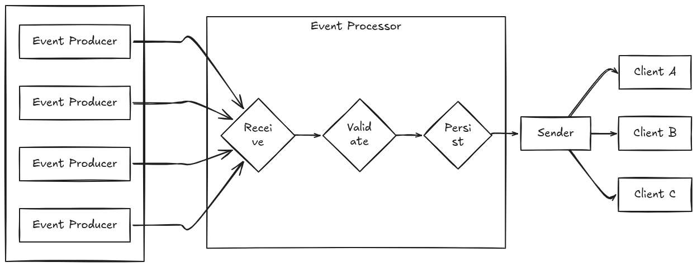
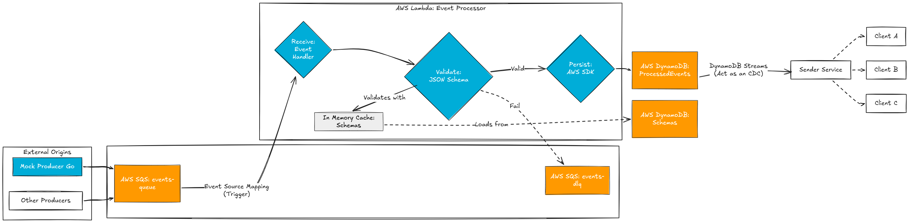

# Challenge: Event Processor

Este projeto é a implementação de um componente **Event Processor** para uma plataforma de dados. O objetivo é construir um serviço reativo focado em consumir eventos de uma mensageria, realizar a validação contra contratos pré-definidos e fazer a triagem. O resultado final deve garantir baixa latência para o consumo por serviços subsequentes, operando de forma resiliente em um ecossistema multi-tenant.

---

## 🏗️ 1. Arquitetura e Decisões Técnicas

Para atender aos requisitos de escalabilidade e resiliência, a seguinte stack foi definida para simulação local:

* **Mensageria (AWS SQS):** Escolhido para garantir que nenhum evento seja perdido em caso de falhas. O SQS atuará com o a flila de eventos e será configurado com uma Dead Letter Queue (DLQ) para mensagens que estiverem inválidas ou com algum problema no processamento. 
  * Eu havia considerado o uso do Kafka, mas optei pelo SQS pelos seguintes motivos: 
    * Integração nativa (*Event Source Mapping*) com o AWS Lambda. 
    * Como a arquitetura proposta não exige a garantia de ordem estrita de processamento ou *replay* histórico de eventos, o SQS atende perfeitamente ao requisito de mensageria com resiliência sem a sobrecarga de gerenciar *brokers*, partições ou *offsets* exigida pelo Kafka.
* **Processamento (AWS Lambda em Go):** A arquitetura utilizará o modelo *Event-Driven* com AWS Lambda (linguagem de progamação Go) acionada nativamente pelo SQS. 
  * *Por que não Kubernetes com HPA?* Embora rodar a aplicação em pods dentro de um cluster Kubernetes e escalá-los horizontalmente (HPA) observando a profundidade da fila e escalando de acordo seja uma abordagem robusta, ela introduz uma complexidade operacional significativa (gerenciamento de cluster, manifestos, e etc...). A AWS Lambda oferece escalabilidade elástica gerida pela própria nuvem, instanciando novos ambientes de execução instantaneamente conforme o volume da fila aumenta. Isso atende perfeitamente ao requisito de criar um serviço reativo de alta performance, priorizando a **simplicidade**.
* **Validação (JSON Schema):** Para atender à regra de contratos declarativos, os *schemas* em JSON serão cacheados em memória durante a inicialização da Lambda, validando o *payload* de forma extremamente rápida. 
    - Outras formas de validar seriam, por exemplo, o uso de Protobuf (Protocol Buffers), validação estrutural no código via *struct tags*, porém, escolhi a JSON Schema pois permite especificar os eventos de forma declarativa e ser usada como base para a validação. Além de ser **agnóstica de linguagem e nativamente suportada por payloads JSON (padrão de mercado)**, ela permite adicionar novos produtores e regras apenas incluindo novos arquivos de contrato, sem a necessidade de recompilar a aplicação.
* **Persistência (AWS DynamoDB):** Banco NoSQL que escala horizontalmente por natureza. A modelagem usará a `Partition Key` para agrupar dados por `client_id` (multi-tenant) e `Sort Key` com id único do evento para garantir a idempotência das mensagens. O uso do *DynamoDB Streams* atuará como um CDC (Change Data Capture), habilitando o consumo de baixa latência por outros serviços (Sender).
  * Eu havia considerado, inicialmente, PostgresSQL ou CassandraDB, porém:
  * *Por que não PostgreSQL?* Embora o Postgres consiga lidar com os payloads dinâmicos usando o tipo `jsonb`, bancos relacionais enfrentam gargalos de escalabilidade horizontal em cenários de alta ingestão (*write-heavy*) e exigiriam um gerenciamento complexo de pool de conexões via Lambda.
  * *Por que não CassandraDB?* O Cassandra lidaria perfeitamente com o alto volume de escritas e a escalabilidade, porém adicionaria uma complexidade operacional considerável (manutenção de cluster e tuning) que vai contra a premissa de simplicidade. O DynamoDB entrega a mesma performance no modelo *Serverless*.

### Diagrama da Solução

---

## 📋 2. Roadmap de Implementação

### Requisitos Funcionais
- [ ] **Consumo:** O serviço deve consumir eventos de uma fila SQS.
- [ ] **Roteamento por Tipo:** Distinguir eventos utilizando um identificador de tipo (`event_type`).
- [ ] **Validação Declarativa:** Validar os eventos recebidos contra os contratos.
- [ ] **Persistência Preparatória:** Salvar o evento no DynamoDB.

### Requisitos Não Funcionais
- [ ] **Resiliência:** Implementação de DLQ para garantir zero perda de eventos inválidos ou com falha.
- [ ] **Testabilidade:** Criação de testes unitários e de integração (integração com os componentes usando LocalStack).
- [ ] **Reprodutibilidade:** Criação de um ambiente Docker/LocalStack com script de infraestrutura para facilitar a validação.